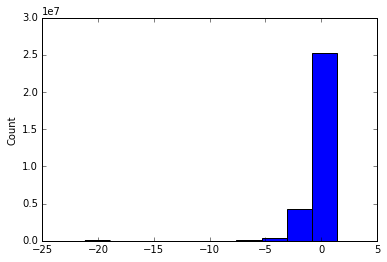
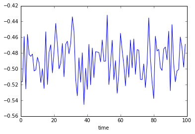

# Prototype Climate Impact Lab Interface

## Workspace Setup

Import some python modules


```python
%matplotlib inline
from matplotlib import pyplot as plt
import prototype
```

## Connect to the API

Authenticate with the [prototype] API, and define how you want to use the system


```python
api = prototype.ClimateImpactLabDataAPI(
    username='mdelgado', 
    password='*********')

api.configure(sample='median', location='OSDC', priority='low')
```

    API configuration updated
    

## Retrieve formatted Climate Impact Lab variables


```python
# mortality regression parameters
alpha  = api.get_variable('alpha')
gamma1 = api.get_variable('gamma1')
gamma2 = api.get_variable('gamma2')
gamma3 = api.get_variable('gamma3')

# GCP-wide socioeconomic parameters
avg_days_per_bin = api.get_variable('avg_days_per_bin')
gdp_per_capita   = api.get_variable('gdppc')
pop_density      = api.get_variable('popdens')

# Climate variables
temp = api.get_variable('temp')
```


```python
# Get variable attributes
temp.attrs
```


    OrderedDict([('symbol', 'T'), ('description', 'NASA downscaled climate data')])


## Do math with Impact Lab variables


```python
# From the NAS mortality presentation...

betahat = alpha+gamma1*avg_days_per_bin+gamma2*(gdp_per_capita.ln())+gamma3*(pop_density.ln())
```


```python
# define how your new variable should look
betahat.symbol = '\\hat{{\\beta}}'
```


```python
# show LaTeX for the math we just did
betahat.display()
```

![betahat][]

[betahat]: http://latex.codecogs.com/gif.latex?%24%5Cbeta_%7Bbins%2Cadm2%2Ctime%7D%20%3D%20%5Calpha_%7Bbins%7D%20+%20%5Cleft%28%7B%7B%5Cgamma_1%7D%7D_%7Bbins%7D%5Cright%29%5Cleft%28AvgDaysPerBin_%7Bbins%2Cadm2%2Ctime%7D%5Cright%29%20+%20%5Cleft%28%7B%7B%5Cgamma_2%7D%7D_%7Bbins%7D%5Cright%29%5Cleft%28%5Cln%7B%5Cleft%28GdpPC_%7Badm2%2Ctime%7D%5Cright%29%7D%5Cright%29%20+%20%5Cleft%28%7B%7B%5Cgamma_3%7D%7D_%7Bbins%7D%5Cright%29%5Cleft%28%5Cln%7B%5Cleft%28PopDensity_%7Badm2%2Ctime%7D%5Cright%29%7D%5Cright%29%24


```python
# Also, show the result of the calculation
betahat.value
```


    <xarray.DataArray (bins: 12, adm2: 24999, time: 100)>
    array([[[ 0.13070758,  0.27115357,  0.51208013, ...,  0.75042949,
              0.97468369,  0.38654286],
            [ 0.45469313, -0.58699997,  0.89999766, ...,  0.0932762 ,
              0.27909178,  0.25180471],
            [ 0.78249511,  0.6007064 ,  0.31142451, ...,  0.7384293 ,
              0.50259999,  0.89219784],
            ..., 
            [ 0.09726135,  0.53286143, -0.23998856, ...,  0.22746566,
              1.01581255,  0.27642734],
            [ 0.94900355,  0.95514836,  0.81664952, ...,  0.18979607,
              0.64628862,  0.35505172],
            [-0.28351735,  0.29136219,  0.96207262, ..., -0.39525938,
              0.52056722,  0.26820543]],
    
           [[-0.24982154,  0.25459062,  0.18381526, ...,  0.86366869,
              1.15629761,  0.52607199],
            [ 0.04221185, -0.69654775,  0.49941067, ..., -0.2538949 ,
              0.19605259,  0.12404486],
            [ 0.68108903,  0.38304013,  0.29892101, ...,  0.66033363,
              0.65525907,  0.64782637],
            ..., 
            [ 0.10886929,  0.11420064, -0.76898607, ...,  0.52976564,
              0.81398773, -0.02587275],
            [ 0.49060749,  0.65472517,  0.90772419, ...,  0.11534893,
              0.19195818,  0.27063844],
            [-0.82047299, -0.03915025,  0.62043444, ..., -0.33573926,
              0.61454831,  0.20731075]],
    
           [[ 0.29334982, -0.1410393 ,  0.06668666, ...,  0.19058335,
              0.38035987, -0.76053658],
            [ 0.24590676, -0.19187054,  0.33738993, ..., -0.03573067,
              0.05934987, -0.36174642],
            [ 0.14058797,  0.22807228,  0.02445355, ...,  0.38002263,
             -0.05175731,  0.18988073],
            ..., 
            [ 0.26074214,  0.27289792, -0.56491045, ..., -0.66360662,
              0.47412097, -0.02909703],
            [ 0.23397792,  0.41959969,  0.36822878, ..., -1.09986828,
              0.2577988 , -0.15395848],
            [-0.01366349, -0.41443745,  0.41451397, ..., -0.53642207,
              0.06734171,  0.14076383]],
    
           ..., 
           [[-1.22909687, -0.16171115, -0.35495874, ...,  0.03058367,
              0.83641502,  0.6679868 ],
            [-0.64060209, -2.40039114,  0.61196964, ..., -0.91890489,
             -0.67590221, -0.14152328],
            [ 0.72354879,  0.41586095, -0.04011696, ...,  0.4473447 ,
              0.15337609,  0.45083991],
            ..., 
            [-0.93966302, -0.38880867, -1.61066037, ...,  0.12229467,
              0.84788684, -0.44109869],
            [ 0.9050935 ,  0.50790203,  0.37243353, ...,  0.70626393,
             -0.1332156 , -0.12347863],
            [-2.13993911, -0.13466855,  0.82092427, ..., -2.03681629,
              0.16071452, -0.66681163]],
    
           [[-1.78127977, -0.64995827, -0.70599218, ..., -0.08563787,
              0.53846099, -0.03527768],
            [-0.96737409, -3.3405469 ,  0.12035706, ..., -1.24401243,
             -1.18152117, -1.02750102],
            [ 0.43426372,  0.06269273, -0.77531073, ..., -0.07509919,
             -0.01719537,  0.41981726],
            ..., 
            [-1.69569958, -0.67028133, -2.24069923, ..., -0.74557355,
              0.78917575, -0.96980891],
            [ 0.54463694,  0.35235451,  0.05831266, ..., -0.09088725,
             -0.45957768, -0.72981302],
            [-2.66118488, -0.83070028,  0.461331  , ..., -2.61814683,
             -0.45347083, -1.47672656]],
    
           [[ 0.05461305,  0.79718925,  0.60464898, ...,  0.8691447 ,
              1.29582956,  1.03214796],
            [ 0.50555223, -0.341628  ,  1.15139969, ...,  0.33088638,
              0.35190861,  0.4681457 ],
            [ 1.23498927,  0.70501668,  0.74332358, ...,  1.03057786,
              0.87111314,  1.15050731],
            ..., 
            [ 0.26777543,  0.43157869, -0.0971003 , ...,  0.81305677,
              1.24930213,  0.59565844],
            [ 0.94444546,  1.06483473,  0.81508081, ...,  0.84482893,
              0.82771585,  0.52695798],
            [-0.36370791,  0.70637385,  1.00317956, ...,  0.02623079,
              0.67527143,  0.47231838]]])
    Coordinates:
      * bins     (bins) int32 0 1 2 3 4 5 6 7 8 9 10 11
      * adm2     (adm2) int32 1 2 3 4 5 6 7 8 9 10 11 12 13 14 15 16 17 18 19 20 ...
      * time     (time) int32 0 1 2 3 4 5 6 7 8 9 10 11 12 13 14 15 16 17 18 19 ...
    Attributes:
        symbol: \hat{{\beta}}


## Use functions from xArray and the rest of python


```python
ax = betahat.value.plot()
plt.show(ax)
```





## The next step in the calculation...


```python
# simplify the representation of betahat:
betahat.symbolic = '\\hat{{\\beta}}'
```


```python
# sum betahat*temp across bins
mortality = (betahat * temp).sum(dim='bins')

# declare a symbol for mortality
mortality.symbol = 'M'
```


```python
mortality.display()
```


![mortality][]

[mortality]: http://latex.codecogs.com/gif.latex?%24M_%7Badm2%2Ctime%7D%20%3D%20%5Csum_%7Bbins%7D%7B%5Cleft%7B%5Cleft%28%5Chat%7B%7B%5Cbeta%7D%7D%7Bbins%2Cadm2%2Ctime%7D%5Cright%29%5Cleft%28T%7Bbins%2Cadm2%2Ctime%7D%5Cright%29%5Cright%7D%7D%24


Note that the dimensionality of mortality is less than beta and temp in the LaTeX and data:


```python
mortality.value
```


    <xarray.DataArray (adm2: 24999, time: 100)>
    array([[ -2.92124395e+00,  -1.99362992e+00,  -8.93652801e-01, ...,
              1.10621390e+00,   2.57830688e+00,  -2.29306181e+00],
           [ -1.38629855e+00,  -7.76493092e+00,   2.03159987e+00, ...,
             -3.41893630e+00,  -4.84213829e+00,  -2.45017356e+00],
           [  1.56519757e+00,  -2.41087398e-01,  -4.24496624e-01, ...,
              1.36587685e+00,  -5.93521188e-01,   2.76255544e+00],
           ..., 
           [ -3.31492736e+00,   6.77445891e-03,  -5.47755159e+00, ...,
             -6.10378895e+00,   3.93503051e+00,  -3.73371494e+00],
           [  3.06004915e+00,   2.91296446e+00,   3.59191665e+00, ...,
             -7.61977078e+00,   5.19491826e-01,  -1.90245230e+00],
           [ -7.99817007e+00,  -4.96106865e+00,   3.18680168e+00, ...,
             -8.19163235e+00,  -8.54668938e-01,  -8.54509732e-01]])
    Coordinates:
      * adm2     (adm2) int32 1 2 3 4 5 6 7 8 9 10 11 12 13 14 15 16 17 18 19 20 ...
      * time     (time) int32 0 1 2 3 4 5 6 7 8 9 10 11 12 13 14 15 16 17 18 19 ...
    Attributes:
        symbol: M


```python
ax = mortality.value.mean(dim='adm2').plot()
plt.show(ax)
```




